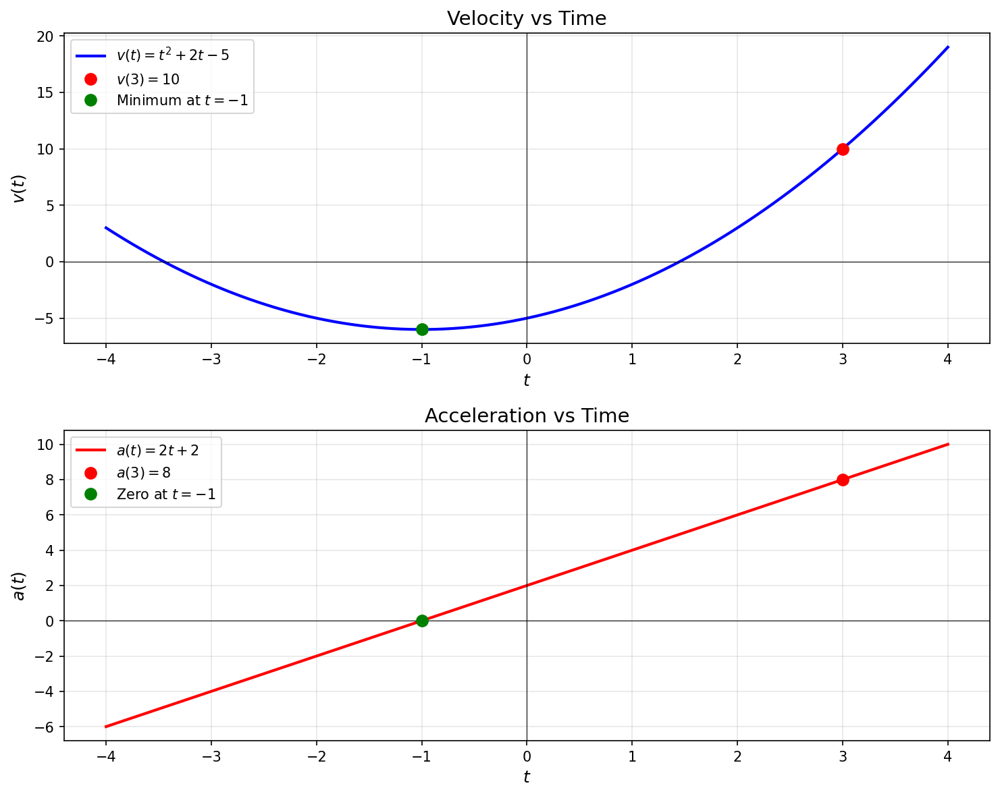

# Problem 6: Variable Velocity

We are given the velocity function $v(t)=t^2+2t-5$ and the initial position $x(0)=4$.

We want:

1. The position at $t=3$, i.e. $x(3)$.
2. The acceleration at $t=3$, i.e. $a(3)$.

---

## 1) Position from velocity theory

Velocity is the derivative of position:

$$
v(t)=\frac{dx}{dt}
$$

So:

$$
\frac{dx}{dt}=t^2+2t-5
$$

Integrate both sides with respect to $t$:

$$
x(t)=\int (t^2+2t-5)\,dt
$$

Compute the integral term-by-term:

$$
\int t^2\,dt=\frac{t^3}{3},\qquad
\int 2t\,dt=t^2,\qquad
\int (-5)\,dt=-5t
$$

So the general position function is:

$$
x(t)=\frac{t^3}{3}+t^2-5t+C
$$

Use the initial condition $x(0)=4$:

$$
x(0)=\frac{0^3}{3}+0^2-5\cdot 0 + C = C = 4
$$

Therefore:

$$
x(t)=\frac{t^3}{3}+t^2-5t+4
$$

Now evaluate at $t=3$:

$$
x(3)=\frac{3^3}{3}+3^2-5\cdot 3+4
=\frac{27}{3}+9-15+4
=9+9-15+4
$$

Compute:
$$
9+9=18,\qquad 18-15=3,\qquad 3+4=7
$$

So:

$$
x(3)=7
$$

---

## 2) Acceleration from velocity

Acceleration is the derivative of velocity:

$$
a(t)=\frac{dv}{dt}
$$

Differentiate:

$$
v(t)=t^2+2t-5
\quad\Rightarrow\quad
a(t)=2t+2
$$

Evaluate at $t=3$:

$$
a(3)=2\cdot 3 + 2 = 8
$$

---

## Final answers

$$
x(3)=7
$$

$$
a(3)=8
$$

---

## Plot the velocity and acceleration

### Velocity plot: $v(t) = t^2 + 2t - 5$

The velocity function is a parabola opening upward with vertex at $t = -1$:
- At $t = -1$: $v(-1) = 1 - 2 - 5 = -6$ (minimum velocity)
- At $t = 0$: $v(0) = -5$
- At $t = 3$: $v(3) = 9 + 6 - 5 = 10$

The function crosses zero at $t \approx 1.45$ and $t \approx -3.45$.

### Acceleration plot: $a(t) = 2t + 2$

The acceleration function is a linear function:
- At $t = 0$: $a(0) = 2$
- At $t = 3$: $a(3) = 8$
- Crosses zero at $t = -1$

The acceleration is always increasing (constant slope = 2) and becomes increasingly positive for $t > -1$.

Ctr+V

